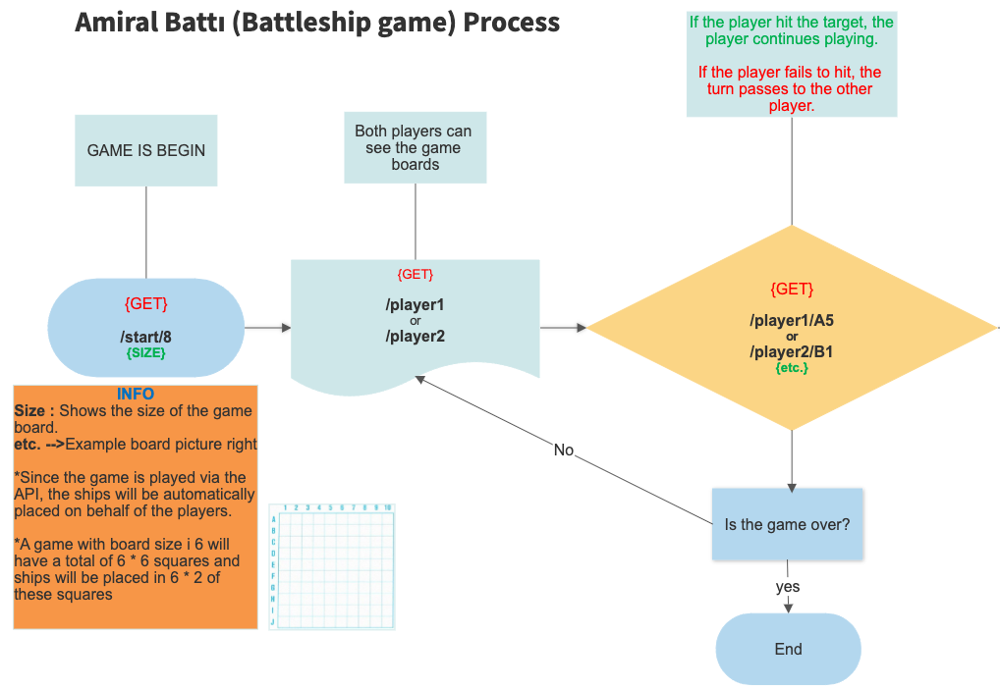

### AMİRAL BATTI (BATTLESHIP GAME)

## Project Struncture

    utils/
    └── app.js
    server/
    └── server.js
    helpers/
    └── sendType.js

## Game Process

## Technologies Used

* NodeJs Backend
* memory-cache
* cors
* expressJs

## Setup/Installation Requirements

* npm install
* npm start

## Youtube Video 
[Preview Link](https://youtu.be/RfoLBi_49HQ)

## Contact Information 
[Linkedin](https://www.linkedin.com/in/ramazan-g%C3%BCnindi)

